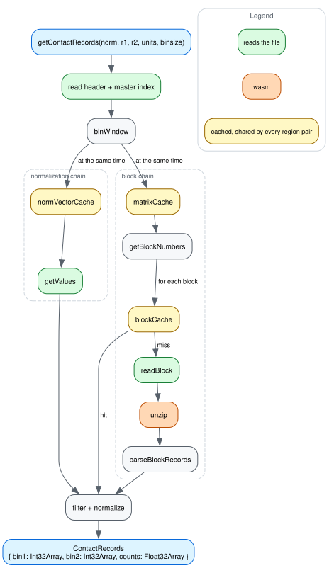

# How a fetch flows

A `.hic` file records how often two stretches of a genome were found touching
each other inside the nucleus. A fetch asks one question of it: for these two
regions, at this resolution, how many contacts join each pair of positions?

## The words on the diagram

**Bin.** The genome is cut into fixed-width windows — 2.5 Mb, or 100 kb, or
5 kb — and a contact is filed under the bin its two ends fall in, not under its
exact coordinates. The width is the `binsize`, and a file stores several of
them, so the same data exists at several zoom levels. Bin indices count from the
start of their chromosome, so bin 40 at 2.5 Mb begins at 100 Mb.

**Matrix.** Contacts have two ends, so their counts form a grid: one axis is
bin along the first chromosome, the other bin along the second, and a cell holds
the count joining that pair of bins. Each chromosome pair gets its own matrix,
and `chr1 × chr2` is stored once rather than twice — the file keeps only the
half where `bin1 <= bin2`, which is why a query arriving the other way round
comes back `transposed`.

**Block.** A matrix at one zoom level is far too large to read whole, so the
file tiles it into square blocks, compresses each one on its own, and writes an
index of where they sit. A viewport asks for the handful of tiles it overlaps.

**Vector.** Some bins are simply easier to see than others — sequence
composition, mappability, how well that stretch was captured — and left alone
that turns a well-covered bin into a bright stripe across the whole matrix. The
correction is one number per bin, so it is one-dimensional, a **vector** along a
single chromosome, where the counts it corrects are two-dimensional. A
normalized count is the raw count divided by `v1[bin1] * v2[bin2]`: the value
for its row bin times the value for its column bin. `KR`, `VC` and `SCALE` are
different recipes for computing that vector, and a file may carry several, or
none.

## The path

[dataflow.dot](img/dataflow.dot) is the source; see
[CONTRIBUTING.md](../CONTRIBUTING.md) for how to re-render it. Each node names
the code underneath it in the small grey line.

`getContactRecords` parses the header once, turns the two regions into bin
windows, and then runs two independent chains: one resolves the normalization
vectors for the pair's chromosomes, the other resolves the blocks covering its
bin square. They meet in the filter, which keeps the contacts inside the window
and divides each count by the product of its two normalization values.

Why each of those steps looks the way it does, and what measurement settled it,
is [optimizations.md](optimizations.md).

The diagram draws the main path only. It leaves out the pre-v9 walk that locates
the normalization vector index, the three block encodings `parseBlockRecords`
dispatches on, and the version differences in field widths that run through all
of it. A fetch asking for `NONE` skips the normalization chain outright and
returns the file's raw counts.

## Why the path forks

A `.hic` fetch pays round-trip **depth**, not read count, and the two chains
read nothing from each other: normalization needs a vector header then its
values, blocks need a matrix header then the blocks themselves. Awaiting them
in sequence makes a region pair four sequential waves deep where two will do.
Nothing about the number of reads changes, which is why only a depth-measuring
test sees it — `test/readChainDepth.test.ts` batches every read issued in the
same macrotask turn and counts the drains.

Depth is also why the block chain fans out rather than iterating: a pair's
missing blocks go out in one `Promise.all`, so the second wave costs one round
trip however many blocks the bin square covers.

The fork is per region pair, and a caller usually issues many pairs at once. A
whole-genome human view is 24 regions, so 300 pairs, and those 300 run
concurrently on top of the fork inside each one.

## Why so much of it is yellow

Every yellow node is shared across the pairs of one fetch, and the sharing is
what makes a multi-region view affordable. A chromosome appears in every pair it
takes part in, so its normalization vector is fetched once rather than once per
pair; a chromosome pair's matrix is fetched once however many blocks it yields.

Two properties of those caches matter beyond the color. Each holds the
**in-flight promise**, not the resolved value, because concurrent pairs
otherwise all miss while the first is still reading. And their capacities are
sized against the pair count rather than against one region — sized for one
region they invert, evicting the entries the same fetch is about to want again.
[optimizations.md](optimizations.md#caches-are-sized-against-the-region-pair-working-set)
has the read counts.

`normVectorCache` is the one whose hit does not reach the filter directly. It
holds the vector, not the vector's values, so a hit still asks for the slice its
region covers — which `NormalizationVector`'s own ±1000-value cache answers
without a read, since the pairs sharing a vector are asking for the same
region's slice of it.

## Why a whole-genome view is affordable

Every chromosome against every other chromosome sounds like the expensive case,
and four separate things keep it from being one.

**The file already did the hard part.** A whole-genome view lands on the
coarsest zoom level, and hg19 at 2.5 Mb bins is about 1,240 bins per axis — call
it 800,000 cells across the whole half-matrix, most of them empty. The same
genome at 5 kb would be 620,000 bins per axis, which is why the zoom levels
exist: a view never reads finer than the pixels it is about to draw.

**Only the overlapping tiles get read.** Blocks are indexed, so a pair reads the
tiles its bin square touches and skips the rest of the chromosome pair. Plenty
of files store no inter-chromosomal matrices at all, and those pairs cost one
lookup and return nothing.

**Work is shared across the 300 pairs, not repeated in each.** 24 regions need
24 normalization vectors between them, not 600, and one matrix per chromosome
pair however many blocks come out of it — the yellow nodes above. On
`test/data/test.hic` that whole-genome fetch is 648 range reads cold, and 0 on
the repeat fetch a pan issues.

**Latency overlaps instead of accumulating.** The 300 pairs are in flight
together, each two waves deep, so the fetch costs roughly two round trips of
waiting rather than 300 chains end to end. What is left is bandwidth and
decoding, which is the part that scales with how much data you actually asked
for.

The result then stays cheap to hold: contacts come back as three parallel typed
arrays rather than a million small objects, which is what keeps a cache of them
off the garbage collector's list (see
[optimizations.md](optimizations.md#contacts-are-struct-of-arrays)).

## Where decompression sits

Decompressing blocks is the one CPU-bound step of the fetch, and the diagram
gives it the plain grey of an ordinary JS call: blocks go through
[`pako-esm2`](https://www.npmjs.com/package/pako-esm2). The sibling parsers draw
that node in wasm orange, where a libdeflate build inflates this file's blocks
about 4× faster. This package stays on pako anyway, because decompression is
roughly a fifth of a cold local fetch and a remote one is latency-bound long
before it is CPU-bound. The bundle cost, and why the platform's own
`DecompressionStream` loses to both, are in
[optimizations.md](optimizations.md#measured-but-not-done-a-faster-inflate).

There is no worker pool either, so the legend carries no purple. Nothing on this
path needs the main thread, so a caller who wants the work off it can run the
whole diagram in a worker of its own.
